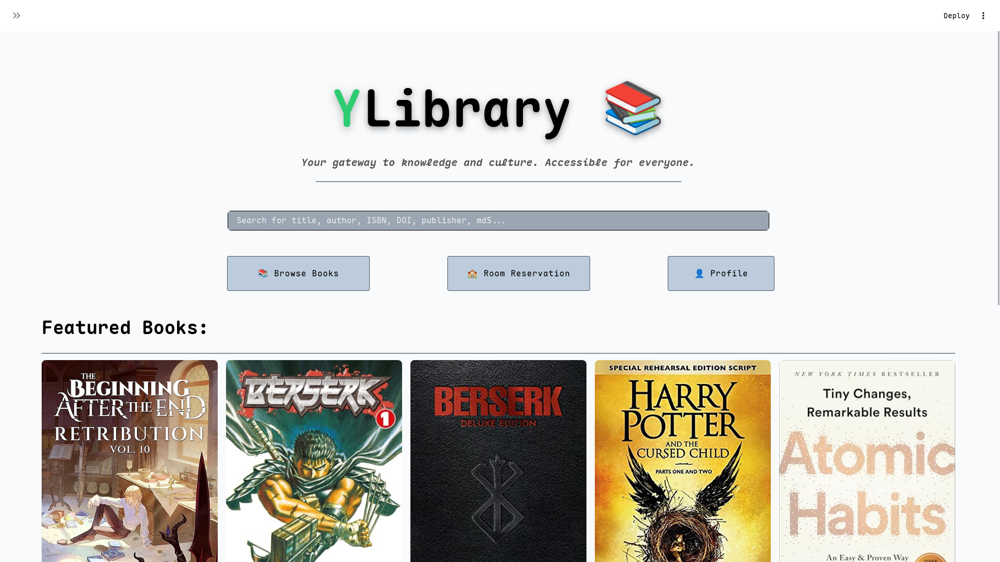
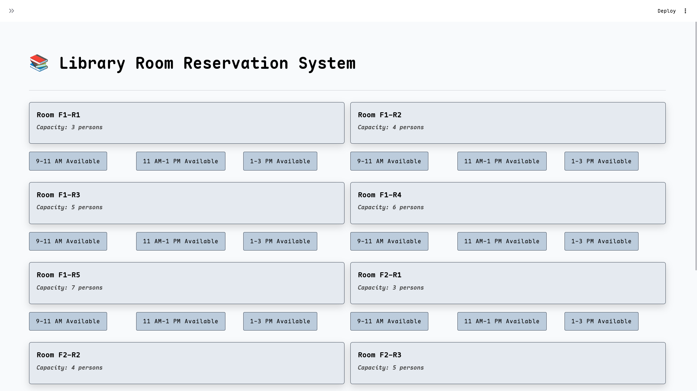

# 📚 Library Management System (YLibrary)

A full-stack **Library Management System** built with a modern Python stack.  
The project provides a clean, user-friendly interface for browsing books, searching the catalog, viewing book details, and managing room reservations, backed by a robust API and database.

This system was designed with **modularity, scalability, and clean architecture** in mind, following clear separation between frontend, backend, and services.

---

## ✨ Features

### 📖 Book Management
- Browse all available books
- Search books by title, author, ISBN, DOI, publisher, or keywords
- View detailed book information (cover, authors, metadata)
- Borrow status tracking (mock state for now)

### 🏫 Room Reservation
- View available rooms
- Reserve library rooms (via backend integration)

### 👤 User & Authentication
- User authentication system
- Role-based access (students, staff, admins)
- Secure login and session handling

### 🎨 Frontend (Streamlit)
- Clean and consistent UI design
- Component-based architecture (OOP)
- Reusable UI components (grids, cards, search bars)
- Responsive layout

### 🛠 Backend (FastAPI)
- RESTful API design
- Authentication & authorization
- Database integration
- Clean service layer

---

## 🖼 Screenshots

### Home Page


### Room Reservation


---

## 🧱 Project Structure (Simplified)

```text
src/library_management/
├── main.py                # FastAPI backend entry point
├── models/                # Database models
├── routes/                # API routes
├── services/              # Business logic & API helpers
├── ui/                    # Streamlit frontend
```

### 1. Clone the repository

```bash
git clone https://github.com/MarwanULQ/Library-Management-System.git
cd Library-Management-System

```

### 2. Create and activate a virtual environment
## For linux/macOS

```bash
python3 -m venv .venv
source .venv/bin/activate

```
## For Windows
```
python -m venv venv
venv\Scripts\Activate.ps1
```

### 3. Install dependencies

```bash
pip install -r requirements.txt
```

### if new dependencies are added
```bash
pip freeze > requirements.txt
```
### 4. Run the application
## For Linux/macOS
```bash
chmod +x launch.sh
./launch.sh
```
## For Windows
```bash
.\launch.ps1
```

## 👥 Team Members & Contributions

| Name | GitHub | Contribution |
| ---- | ------ | ------------ |
| **Marwan** | `MarwanULQ` | Frontend & UI |
| **Youssef** | `zainstark` | Frontend development |
| **Amr** | `Aki3006` | Backend integration & authentication |
| **Ahmed** | `AhmedElshentenawy` | Database design & backend |
| **Ali** | `Ali-Khamis45` | Testing & validation |
